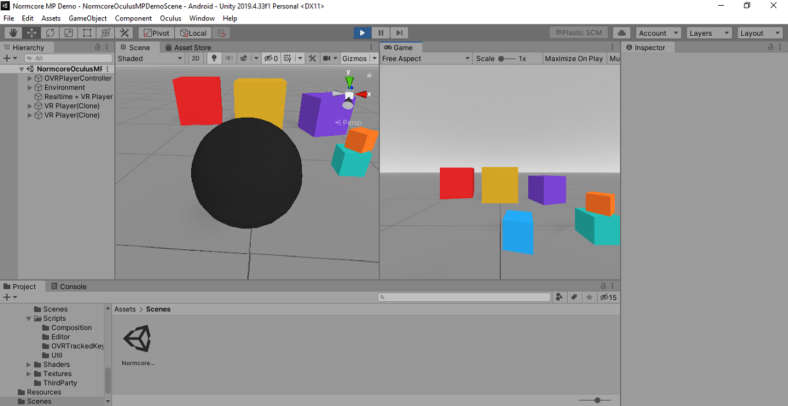

# Normcore Oculus Multiplayer Demo

Sample project to implement multiplayer interaction using normcore in Unity3D

## Requirements

- Unity3D 2019.4.33f1
- [Normcore 2](https://normcore.io/)   [download](https://assetstore.unity.com/packages/tools/network/normcore-free-multiplayer-voice-chat-for-all-platforms-195224)
- Oculus Integration  [download](https://assetstore.unity.com/packages/tools/integration/oculus-integration-82022)

## Demo

